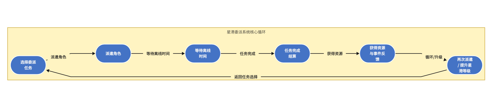
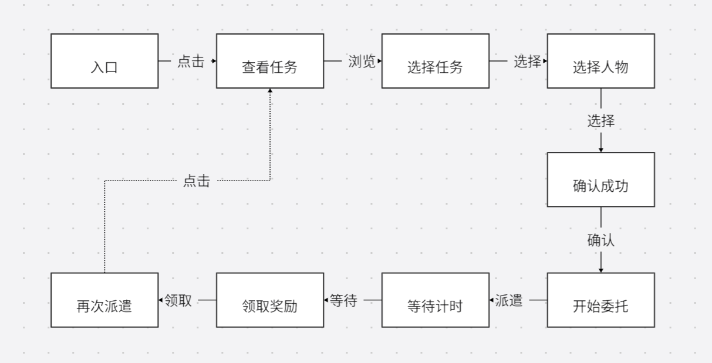

# 《星港委派》离线派遣系统

> 本文为个人原创系统策划案，用于游戏策划实习作品集展示。系统参考常见二游“派遣/远征/委托”类玩法的设计逻辑，但规则、数值与包装为原创方案。

## 0. 一页概述

**系统名称**：星港委派  
**适用游戏类型**：二次元回合制 RPG / 角色养成 RPG  
**系统定位**：离线资源获取 + 角色价值扩展 + 轻量日常活跃  
**目标岗位展示方向**：系统策划、数值策划、执行策划  

### 核心设计目标

1. 为玩家提供稳定的离线资源来源，降低重复刷资源本的压力。
2. 让暂不上场角色也能产生价值，提升角色池利用率。
3. 通过每日收取与再派遣，提供低负担的日常上线理由。
4. 用任务类型、角色标签、风险事件和委派时长提供轻量策略选择。
5. 控制奖励强度，避免派遣系统替代核心战斗玩法。

### 核心循环



```text
选择委派任务 -> 派遣角色 -> 等待离线时间 -> 结算奖励 -> 获得资源/事件反馈 -> 再次派遣
```

---

## 1. 系统定位

《星港委派》是一个轻量资源产出系统。玩家可以将已拥有角色派遣到不同区域执行任务，经过一定现实时间后获得养成资源、货币、材料或少量随机奖励。

该系统不追求复杂操作，也不替代战斗玩法。它的主要价值是让玩家在离线期间也能获得成长，并让非主力角色拥有稳定用途。

| 设计维度 | 说明 |
| --- | --- |
| 玩家需求 | 离线收益、减轻资源本压力、提高角色池利用率 |
| 产品目标 | 提升日常留存、延长养成目标、增加角色收集价值 |
| 系统强度 | 中低收益，辅助养成，不替代主线和副本 |
| 操作频率 | 每日 1-2 次即可完成主要收益 |
| 策略深度 | 任务时长、角色标签、成功率、风险事件 |

---

## 2. 解锁条件

| 条件 | 规则 |
| --- | --- |
| 玩家等级 | 账号等级达到 12 级 |
| 主线进度 | 通关主线第 2 章第 3 节 |
| 初始派遣栏位 | 2 个 |
| 最大派遣栏位 | 5 个 |
| 栏位解锁 | 随账号等级和星港等级逐步解锁 |

### 栏位解锁表

| 栏位 | 解锁条件 | 设计目的 |
| --- | --- | --- |
| 第 1-2 栏 | 系统解锁时开放 | 保证新手立即体验 |
| 第 3 栏 | 账号等级 20 | 提高成长反馈 |
| 第 4 栏 | 账号等级 35 | 中期增加收益容量 |
| 第 5 栏 | 星港等级 5 | 给长期玩家目标 |

---

## 3. 玩家流程

### 3.1 首次引导流程

```text
玩家达到解锁条件
-> 主界面出现“星港委派”入口
-> NPC 引导说明派遣用途
-> 系统推荐一个 2 小时短任务
-> 玩家选择角色
-> 点击开始委派
-> 任务进入倒计时
-> 到期后返回领取奖励
```

首次引导只展示基础流程，不展示全部复杂规则，避免新手信息负担过重。

### 3.2 日常使用流程



```text
进入星港委派界面
-> 查看可用任务列表
-> 选择任务
-> 查看推荐标签与预计奖励
-> 选择角色
-> 确认成功率与耗时
-> 开始委派
-> 等待任务完成
-> 领取奖励与事件反馈
-> 刷新或继续派遣
```

---

## 4. 任务类型

系统提供 4 类基础任务，每类任务对应不同资源目标。

| 任务类型 | 主要奖励 | 推荐角色标签 | 适合玩家需求 |
| --- | --- | --- | --- |
| 物资采买 | 通用货币 | 商贸、社交 | 缺基础货币玩家 |
| 遗迹勘察 | 角色经验材料 | 探索、学识 | 养新角色玩家 |
| 星港维护 | 武器/装备强化材料 | 工程、耐力 | 强化装备玩家 |
| 异常调查 | 稀有材料、随机事件 | 战斗、洞察 | 中后期玩家 |

### 任务时长分类

| 时长 | 基础收益 | 适用场景 |
| --- | ---: | --- |
| 2 小时 | 低 | 新手教学、碎片时间 |
| 4 小时 | 中 | 白天短周期收取 |
| 8 小时 | 高 | 睡前/上课/上班前派遣 |
| 12 小时 | 最高但单位效率略低 | 低频玩家兜底 |

设计原则：

```text
短任务单位时间收益略高，长任务操作压力更低。
```

这样可以让高活跃玩家和低频玩家都有合理选择。

---

## 5. 角色派遣规则

### 5.1 基础规则

| 规则 | 说明 |
| --- | --- |
| 每个任务需要角色数 | 1-3 名 |
| 同一角色限制 | 同一时间只能参与 1 个派遣任务 |
| 战斗使用限制 | 派遣中角色仍可参与战斗，避免影响主线体验 |
| 推荐标签 | 角色标签匹配任务可提高成功率与额外奖励概率 |
| 角色等级 | 影响基础成功率，但影响幅度较小 |

说明：派遣不限制角色参与战斗，是为了避免玩家觉得系统“锁角色”。该系统的目标是扩展角色价值，而不是制造操作负担。

### 5.2 角色标签

每名角色拥有 1-2 个派遣标签。

| 标签 | 作用示例 |
| --- | --- |
| 商贸 | 提升物资采买任务收益 |
| 探索 | 提升遗迹勘察成功率 |
| 工程 | 提升星港维护额外奖励概率 |
| 战斗 | 降低异常调查风险 |
| 学识 | 提升经验材料产出 |
| 社交 | 提升任务事件正向结果概率 |
| 洞察 | 提高稀有事件触发率 |
| 耐力 | 降低长时间任务失败风险 |

---

## 6. 成功率与奖励规则

### 6.1 成功率公式

```text
任务成功率 = 基础成功率 + 标签匹配加成 + 角色等级加成 + 星港等级加成 - 任务难度修正
```

### 6.2 参数建议

| 参数 | 数值 |
| --- | ---: |
| 基础成功率 | 70% |
| 每个匹配标签 | +8% |
| 角色等级达到推荐等级 | +5% |
| 星港每升 1 级 | +2% |
| 普通任务难度修正 | 0% |
| 高危任务难度修正 | -10% |
| 成功率上限 | 100% |
| 成功率下限 | 50% |

### 6.3 成功与失败结算

| 结果 | 奖励 |
| --- | --- |
| 成功 | 获得 100% 基础奖励，并判定额外奖励 |
| 大成功 | 获得 100% 基础奖励 + 50% 额外奖励 |
| 失败 | 获得 50% 基础奖励，无额外奖励 |

大成功概率：

```text
大成功概率 = 5% + 匹配标签数量 × 3% + 特定角色加成
```

大成功概率上限为 25%。

---

## 7. 数值表

### 7.1 基础奖励表

以下为示例数值，可根据具体项目经济系统调整。

| 任务类型 | 2 小时 | 4 小时 | 8 小时 | 12 小时 |
| --- | ---: | ---: | ---: | ---: |
| 物资采买：通用货币 | 2000 | 3800 | 7200 | 10000 |
| 遗迹勘察：经验材料 | 4 | 7 | 13 | 18 |
| 星港维护：强化材料 | 3 | 6 | 11 | 15 |
| 异常调查：稀有材料碎片 | 1 | 2 | 4 | 5 |

### 7.2 单日收益控制

假设玩家中期拥有 4 个栏位，日常使用 8 小时任务，每日收取 2 轮：

```text
每日派遣次数 = 4 栏位 × 2 轮 = 8 次
```

单日派遣收益应控制在：

| 资源类型 | 派遣日产出占比建议 |
| --- | ---: |
| 通用货币 | 不超过日常副本产出的 20%-30% |
| 经验材料 | 不超过日常副本产出的 15%-25% |
| 强化材料 | 不超过日常副本产出的 15%-20% |
| 稀有材料 | 只提供碎片或低概率产出 |

设计目的：派遣系统提供补充收益，但不替代资源本和核心战斗玩法。

---

## 8. 任务刷新规则

| 规则 | 说明 |
| --- | --- |
| 每日自然刷新 | 每天 04:00 刷新任务池 |
| 任务池数量 | 默认显示 6 个任务 |
| 免费手动刷新 | 每日 1 次 |
| 付费刷新 | 不建议加入付费刷新，避免资源焦虑 |
| 保底规则 | 每日必定出现至少 1 个货币、1 个经验、1 个强化材料任务 |

任务品质分为普通、优秀、稀有三档。

| 品质 | 出现概率 | 特点 |
| --- | ---: | --- |
| 普通 | 70% | 基础奖励 |
| 优秀 | 25% | 奖励 +20% 或耗时更短 |
| 稀有 | 5% | 可能出现稀有材料碎片或特殊事件 |

---

## 9. 随机事件

为避免派遣系统完全变成机械收菜，任务完成时有小概率触发事件。

| 事件类型 | 触发概率 | 效果 |
| --- | ---: | --- |
| 顺利交涉 | 8% | 额外获得 10% 通用货币 |
| 意外发现 | 5% | 获得少量稀有材料碎片 |
| 路线延误 | 5% | 任务耗时增加 30 分钟，奖励不变 |
| 协作默契 | 3% | 参与角色获得少量好感度 |

事件设计原则：

- 正向事件多于负向事件。
- 负向事件只影响时间，不扣除核心奖励。
- 随机事件提供惊喜感，但不成为主要收益来源。

---

## 10. 星港等级

玩家完成派遣可获得星港经验，提升星港等级，解锁更多栏位与轻量加成。

| 星港等级 | 解锁内容 | 加成 |
| --- | --- | --- |
| Lv.1 | 系统解锁，2 个栏位 | 无 |
| Lv.2 | 解锁优秀任务概率提升 | 成功率 +2% |
| Lv.3 | 解锁第 3 个栏位 | 成功率 +4% |
| Lv.4 | 解锁任务筛选功能 | 成功率 +6% |
| Lv.5 | 解锁第 5 个栏位 | 成功率 +8% |

星港等级提供长期目标，但加成不宜过强，避免新老玩家差距过大。

---

## 11. UI 界面需求

### 11.1 主界面信息

星港委派主界面需要展示：

| 模块 | 内容 |
| --- | --- |
| 顶部信息 | 星港等级、星港经验、当前栏位数 |
| 任务列表 | 任务名称、类型、时长、奖励、推荐标签 |
| 派遣栏位 | 当前进行中的任务、剩余时间、派遣角色 |
| 快捷操作 | 一键领取、再次派遣、任务刷新 |

### 11.2 任务卡片字段

每张任务卡片包含：

```text
任务名称
任务类型
任务品质
任务时长
基础奖励
推荐标签
当前成功率
可能事件
开始按钮
```

### 11.3 角色选择界面

角色选择界面需要展示：

```text
角色头像
角色等级
派遣标签
是否已在派遣中
与当前任务的匹配标签高亮
加入后成功率变化
```

### 11.4 结算界面

结算界面需要展示：

```text
任务结果：成功 / 大成功 / 失败
获得奖励
触发事件
参与角色
星港经验
再次派遣按钮
```

---

## 12. 异常与边界条件

| 情况 | 处理规则 |
| --- | --- |
| 玩家离线期间任务完成 | 下次登录时显示完成状态，奖励不自动进入背包 |
| 背包满 | 奖励进入临时邮箱，保留 7 天 |
| 角色被删除/转换 | 若任务进行中，不允许删除或转换该角色 |
| 服务器跨天 | 已进行任务不受每日刷新影响 |
| 任务完成后跨天未领取 | 奖励保留，栏位保持占用 |
| 网络中断 | 以服务器记录的派遣开始时间和结束时间为准 |
| 手动取消任务 | 返还栏位，不发放奖励 |
| 版本维护 | 维护期间计入派遣时间 |

---

## 13. 新手引导文案示例

NPC：

> 星港每天都有不少委托等着处理。让暂时不上场的伙伴去跑一趟，回来时也许能带回你正缺的物资。

系统提示：

> 选择符合推荐标签的角色，可以提高任务成功率和额外奖励概率。

完成提示：

> 委派完成。角色带回了物资，并积累了星港经验。

---

## 14. 数据埋点与验证指标

| 目标 | 指标 | 说明 |
| --- | --- | --- |
| 系统触达 | 星港委派入口点击率 | 判断入口是否清晰 |
| 新手理解 | 首次派遣完成率 | 判断引导是否有效 |
| 日常活跃 | 日均领取次数 | 判断是否形成日常习惯 |
| 角色利用 | 非主力角色派遣率 | 判断是否扩展角色池价值 |
| 收益平衡 | 派遣资源占总资源比例 | 防止替代核心副本 |
| 策略选择 | 标签匹配率 | 判断玩家是否理解推荐标签 |
| 疲劳控制 | 一键再次派遣使用率 | 判断操作是否需要减负 |

---

## 15. 开发交付标准

### 15.1 程序交付标准

程序侧需要支持：

- 任务池每日刷新。
- 任务开始、取消、完成、领取奖励流程。
- 角色占用状态记录。
- 成功率、大成功、随机事件判定。
- 离线时间结算。
- 跨天、维护、网络中断等服务器时间校验。
- 奖励进入背包或临时邮箱。

验收标准：

| 验收项 | 标准 |
| --- | --- |
| 任务倒计时 | 关闭游戏后再次登录，剩余时间正确 |
| 奖励结算 | 成功、失败、大成功奖励均符合配置表 |
| 角色状态 | 派遣中角色不可重复派遣 |
| 跨天处理 | 每日刷新不影响已开始任务 |
| 异常处理 | 背包满时奖励进入临时邮箱 |

### 15.2 UI 交付标准

UI 侧需要提供：

- 星港委派主界面。
- 任务列表卡片。
- 角色选择弹窗。
- 任务进行中栏位。
- 结算弹窗。
- 刷新确认弹窗。
- 背包满/体力不足/角色占用等提示样式。

验收标准：

| 验收项 | 标准 |
| --- | --- |
| 信息可读性 | 玩家能在 3 秒内看懂奖励、时长、成功率 |
| 标签匹配 | 推荐标签与角色标签有明显高亮 |
| 状态清晰 | 进行中、可领取、空闲栏位状态明确 |
| 操作路径 | 从进入界面到开始任务不超过 4 次点击 |

### 15.3 数值交付标准

数值侧需要配置：

- 任务类型表。
- 任务品质表。
- 任务时长与奖励表。
- 成功率参数表。
- 角色标签表。
- 随机事件表。
- 星港等级表。

验收标准：

| 验收项 | 标准 |
| --- | --- |
| 收益强度 | 日派遣收益不超过日常资源本建议占比 |
| 成功率区间 | 不低于 50%，不超过 100% |
| 随机事件 | 负向事件不扣除核心奖励 |
| 成长节奏 | 星港等级 1-5 预计 14-21 天完成 |

---

## 16. 配置表字段示例

### 16.1 任务表 MissionConfig

| 字段名 | 类型 | 示例 | 说明 |
| --- | --- | --- | --- |
| mission_id | int | 1001 | 任务 ID |
| mission_name | string | 星港物资采买 | 任务名称 |
| mission_type | enum | currency | 任务类型 |
| quality | enum | normal | 任务品质 |
| duration_min | int | 480 | 任务时长，分钟 |
| base_reward_id | int | 2001 | 基础奖励包 ID |
| recommend_tag_1 | enum | commerce | 推荐标签 1 |
| recommend_tag_2 | enum | social | 推荐标签 2 |
| difficulty | int | 1 | 难度等级 |
| event_pool_id | int | 3001 | 随机事件池 |

### 16.2 角色标签表 DispatchRoleTag

| 字段名 | 类型 | 示例 | 说明 |
| --- | --- | --- | --- |
| role_id | int | 101 | 角色 ID |
| tag_1 | enum | commerce | 标签 1 |
| tag_2 | enum | social | 标签 2 |

---

## 17. 版本范围

### 17.1 首版必须实现

- 4 类任务。
- 2/4/8/12 小时时长。
- 2-5 个派遣栏位。
- 角色标签匹配。
- 成功/失败/大成功结算。
- 星港等级 1-5。
- 每日任务刷新。
- 一键领取。

### 17.2 首版暂不实现

- 好友协助派遣。
- 付费刷新任务。
- 派遣专属剧情链。
- 公会协作任务。
- 角色受伤或长时间不可用。

暂不实现原因：控制首版开发量，避免小系统过度复杂。

---

## 18. 设计风险与应对

| 风险 | 说明 | 应对 |
| --- | --- | --- |
| 收益过高 | 玩家不再刷资源本 | 控制日收益占比 |
| 操作过繁 | 玩家觉得派遣也很肝 | 支持一键领取与再次派遣 |
| 策略过弱 | 玩家无脑点推荐 | 加入标签、时长、事件差异 |
| 策略过强 | 新手看不懂 | 首次引导只讲基础流程 |
| 角色占用焦虑 | 玩家担心派遣影响战斗 | 派遣不限制战斗使用 |

---

## 19. 总结

《星港委派》是一个小体量但完整的离线派遣系统。它通过任务类型、角色标签、成功率、随机事件和星港等级，提供轻量策略选择；通过离线收益和每日收取，提供低负担活跃理由；通过非主力角色派遣，扩展角色池价值。

该系统的设计重点不是制造复杂玩法，而是在不抢占核心战斗资源价值的前提下，为玩家提供稳定、可预期、可管理的养成补充。

从作品集角度看，本案展示了以下能力：

| 能力 | 体现 |
| --- | --- |
| 系统设计 | 完整定义解锁、流程、规则、奖励、刷新和成长 |
| 数值意识 | 控制日收益占比，避免替代核心副本 |
| UI 意识 | 明确主界面、任务卡片、角色选择、结算界面需求 |
| 程序协作 | 提供配置字段、异常规则和验收标准 |
| 用户体验 | 避免锁角色、控制操作频率、支持离线结算 |

---

## 20. 可补充图片

如果上传 GitHub，建议补 4 张图：

```text
images/
├─ starport-dispatch-loop.png
├─ starport-dispatch-ui-flow.png
├─ starport-mission-card-wireframe.png
└─ starport-reward-balance.png
```
 
建议插图位置：

```markdown


```
