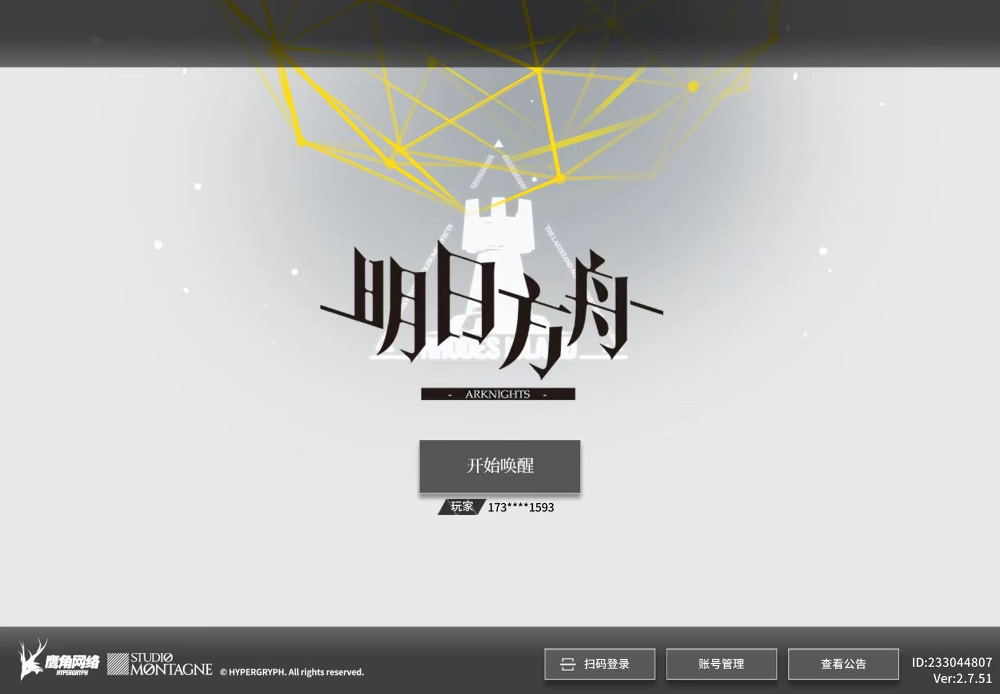
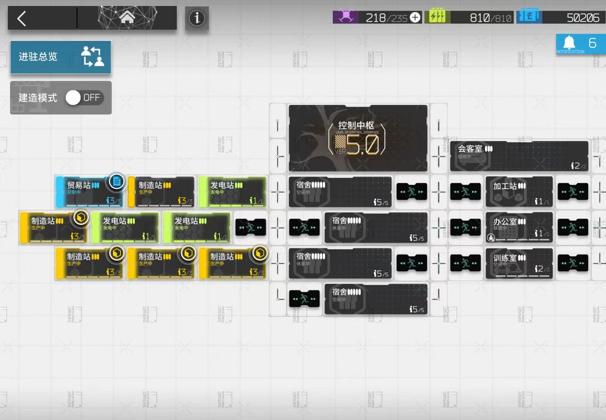

# 《明日方舟》基建系统资源拆解案

> 本文为个人学习与求职作品展示使用。文中涉及《明日方舟》的游戏素材、设定、数据与名称，其版权归原厂商所有。本文仅用于系统设计与数值分析，不作商业用途。

## 0. 一页结论



**分析对象**：《明日方舟》基建系统  
**版本参考**：Ver.2.7.51  
**拆解方向**：系统策划 / 数值策划 / 资源循环 / 长线养成  
**适配岗位**：系统策划、数值策划、执行策划实习

本案核心结论：

1. 《明日方舟》的基建是与体力系统并列的长期资源供给系统，而非单纯的附属收菜玩法。
2. 基建核心由“制造站 - 贸易站 - 发电站”构成生产、转化、加速闭环，其中制造站负责产出，贸易站负责资源变现，发电站通过无人机压缩生产时间。
3. 赤金产线与龙门币订单在无干员加成时存在接近 1:1 的时间咬合关系，因此建筑布局的本质是“产能分配问题”。
4. 243、252、153 等布局不是单纯玩家流派，而是玩家在收益、操作频率、干员储备和资源需求之间做出的不同选择。
5. 基建的优点是降低养成压力、扩展干员价值、提供长期运营深度；主要问题是满级后目标感不足、新手理解门槛较高、成熟布局逐渐固化。
6. 优化方向应优先围绕“降低理解成本”“增加阶段性目标”“保留策略选择”展开，而不是单纯提高产出。

---

## 1. 系统定位

《明日方舟》的基建系统是一个资源生产与管理型养成子系统。它并不直接提供战斗体验，但通过持续产出龙门币、作战记录、信用点、信赖值等资源，支撑玩家的干员养成和长期成长。

从产品结构看，基建承担四个核心职能：

| 职能 | 对玩家的意义 | 对产品的意义 |
| --- | --- | --- |
| 资源供给 | 持续获得龙门币、作战记录等养成资源 | 降低养成压力，平衡副本消耗 |
| 日常活跃 | 收菜、换班、无人机分配形成日常操作 | 提供轻量上线理由 |
| 干员价值扩展 | 非主力干员也能通过基建技能产生价值 | 扩展干员养成目标 |
| 策略运营 | 243、252、153 等布局带来长期选择 | 增加系统深度与玩家讨论 |

基建的价值在于：它为玩家提供了一个不完全依赖体力刷本的资源来源。对中长期玩家来说，基建相当于“第二体力条”：只要系统持续运转，即使玩家不额外刷资源本，也能稳定获得养成材料。

---

## 2. 建筑结构拆解

基建由多个建筑构成，但本案重点关注资源收益相关的核心建筑：制造站、贸易站、发电站。

### 2.1 全建筑功能概览

| 建筑 | 核心功能 | 关键机制 | 系统定位 |
| --- | --- | --- | --- |
| 控制中枢 | 基建核心管理 | 升级解锁楼层；进驻干员降低心情消耗 | 基建总控 |
| 制造站 | 生产经验书、赤金、源石碎片 | 效率受干员技能影响 | 资源生产端 |
| 贸易站 | 赤金转龙门币；源石碎片转合成玉 | 订单消耗原料并产出货币 | 资源转化端 |
| 发电站 | 生产无人机 | 无人机可加速制造站或贸易站 | 时间加速端 |
| 宿舍 | 恢复干员心情 | 决定干员持续工作时间 | 排班支撑 |
| 加工站 | 合成高级材料、拆解家具 | 部分干员提升副产物概率 | 材料转化 |
| 会客室 | 获取信用点与线索 | 社交与信用收益 | 社交资源 |
| 办公室 | 刷新公开招募 | 影响招募券刷新效率 | 招募辅助 |
| 训练室 | 专精干员技能 | 支撑后期战斗养成 | 技能成长 |
| 活动室 | 提升干员信赖 | 提供信赖值与养成反馈 | 角色养成 |

本案重点分析：

```text
制造站 -> 贸易站 -> 龙门币/经验资源
发电站 -> 无人机 -> 压缩制造站/贸易站时间
```




---

## 3. 核心资源循环

### 3.1 三大核心建筑闭环

制造站、贸易站、发电站共同构成基建资源循环：

```text
制造站生产赤金 -> 贸易站消耗赤金 -> 产出龙门币
制造站生产作战记录 -> 直接用于干员养成
发电站生产无人机 -> 加速制造站或贸易站 -> 提升单位时间产出
```

可整理为：

| 子系统 | 输入 | 产出 | 去向 |
| --- | --- | --- | --- |
| 制造站：赤金产线 | 时间 | 赤金 | 贸易站订单原料 |
| 制造站：经验产线 | 时间 | 作战记录 | 干员升级 |
| 贸易站：龙门币订单 | 赤金 + 时间 | 龙门币 | 干员养成、精英化、技能升级 |
| 发电站 | 时间 / 干员效率 | 无人机 | 加速制造站或贸易站 |

基建资源循环的本质是：玩家通过建筑配置与干员排班，将现实时间转化为游戏养成资源。

### 3.2 核心循环图

```text
时间投入
  ↓
制造站产出赤金/经验
  ↓                 ↘
贸易站消耗赤金       作战记录进入养成
  ↓
龙门币进入养成
  ↑
发电站无人机加速生产/订单
```


---

## 4. 测算假设

为了使资源换算可讨论，需要先声明测算口径。

| 项目 | 假设 |
| --- | --- |
| 版本口径 | Ver.2.7.51 |
| 建筑等级 | 核心建筑按当前版本满级计算 |
| 干员加成 | 不计入特殊基建技能加成 |
| 活动加成 | 不计入活动额外掉落或限时加成 |
| 估值方法 | 使用“理智换算法”统一比较资源价值 |
| 主要对象 | 制造站、贸易站、发电站 |

说明：本文的计算不是为了得出绝对最优收益，而是建立一个“无加成基准模型”。实际收益会受到干员技能、排班、布局、无人机使用策略和玩家上线频率影响。

---

## 5. 资源价值换算

### 5.1 副本基准


使用 LS-6 与 CE-6 作为资源换算基准：

| 资源 | 副本口径 | 产出 | 结论 |
| --- | --- | --- | --- |
| 作战记录 | LS-6 | 36 理智获得约 10000 经验 + 432 龙门币 | 经验价值基准 |
| 龙门币 | CE-6 | 36 理智获得 10000 龙门币 | 龙门币价值基准 |

由此可得：

```text
36 理智 = 10000 龙门币
36 理智 = 10000 经验 + 432 龙门币
```

如果将龙门币折算为经验价值：

```text
1 龙门币 ≈ 1.045 经验
```

### 5.2 赤金与经验的换算

制造站基础产能：

```text
制造站产赤金：72 分钟 / 个
制造站产中级作战记录：180 分钟 / 1000 经验
```

180 分钟内：

```text
可产出 1000 经验
也可产出 2.5 个赤金
```

因此：

```text
1000 经验 = 2.5 赤金
1 赤金 = 400 经验
```

贸易站订单：

```text
1 赤金 -> 500 龙门币
500 龙门币 ≈ 522.5 经验
```

扣除赤金本身约 400 经验的机会成本后：

```text
1 个龙门币订单的净价值 ≈ 122.5 经验
```

### 5.3 换算表

| 资源 | 换算关系 | 依据 |
| --- | --- | --- |
| 作战记录 | 36 理智 = 10000 经验 + 432 龙门币 | LS-6 |
| 龙门币 | 36 理智 = 10000 龙门币 | CE-6 |
| 赤金 | 1 赤金 ≈ 400 经验 | 制造站产能换算 |
| 龙门币订单 | 1 赤金 -> 500 龙门币 | 贸易站订单 |
| 龙门币订单净收益 | 约 122.5 经验 | 龙门币价值 - 赤金机会成本 |

---

## 6. 制造站与贸易站的产能咬合

### 6.1 一对一产线

在无干员加成、无无人机介入的理想状态下：

```text
制造站生产 1 赤金：72 分钟
贸易站消耗 1 赤金并产出龙门币订单：约 72 分钟
```

因此：

```text
单条赤金制造站日产量 = 1440 ÷ 72 = 20 赤金/天
单个贸易站日消耗量 = 1440 ÷ 72 = 20 赤金/天
```

这说明：

```text
1 制造站（赤金） + 1 贸易站 = 一条完整的基础产线
```

该产线日产出：

```text
20 赤金 -> 10000 龙门币
10000 龙门币 ≈ 36 理智
```

### 6.2 多产线下的供需问题

当布局扩大时，制造站与贸易站的数量比会决定资源是否溢出或短缺。

以 243 为例：

```text
2 贸易站 + 4 制造站 + 3 发电站
```

如果 4 个制造站全部生产赤金：

```text
4 制造站日产赤金 = 80 赤金
2 贸易站日消耗赤金 = 40 赤金
```

结果：赤金溢出。

因此，243 布局通常会将部分制造站转为经验产线，例如：

```text
2 制造站产赤金
2 制造站产经验
2 贸易站消耗赤金产龙门币
```

这说明 243 布局的价值不在于提供“唯一正确答案”，而在于让赤金产出、贸易站消耗、经验需求之间达到一种相对稳定的平衡。

---

## 7. 发电站与无人机价值

### 7.1 无人机的本质：时间置换

发电站不直接生产龙门币或经验，但它通过无人机压缩制造站或贸易站的生产时间，提高单位时间产出。

```text
发电站 -> 无人机 -> 加速制造站/贸易站 -> 提升资源产出
```

无人机的核心设计逻辑是“时间置换资源”。

### 7.2 无人机收益测算

原稿测算：在满级发电站、无干员加成的理想状态下：

```text
日产出无人机 ≈ 275.86 个
每个无人机加速 3 分钟
总加速时长 = 275.86 × 3 = 827.58 分钟
```

如果全部用于贸易站：

```text
额外完成订单数 = 827.58 ÷ 72 ≈ 11.5 单
额外龙门币收益 = 11.5 × 500 = 5750 龙门币
```

原稿中按订单与时间口径估算额外收益约为：

```text
额外龙门币收益 ≈ 6465.46 龙门币
折合理智 ≈ 23.3 理智/天
```

不同口径下数值会略有差异，但结论一致：无人机显著提高基建产能。

### 7.3 设计意义

发电站的设计价值不在于提供新资源，而在于给玩家提供“加速分配选择”：

| 无人机用途 | 玩家目标 | 结果 |
| --- | --- | --- |
| 加速贸易站 | 快速获得龙门币 | 提升货币收入 |
| 加速制造站赤金 | 补充赤金原料 | 防止贸易站断供 |
| 加速制造站经验 | 补充作战记录 | 支撑干员升级 |

因此，无人机是基建系统中的调节阀：玩家可以根据当前最缺的资源，把时间价值转移到对应产线。

---

## 8. 核心矛盾分析

### 8.1 矛盾一：赤金产线与贸易订单的时间咬合

单条产线在无加成时接近平衡：

```text
72 分钟产 1 赤金
72 分钟消耗 1 赤金并生成订单
```

但当建筑数量扩大、干员效率不同、无人机加入后，系统就会出现供需错位：

- 赤金产出过高：仓库堆积，贸易站消化不完。
- 赤金产出过低：贸易站断供，订单停滞。
- 无人机分配不当：局部产线过快，另一端跟不上。

因此，基建策略的核心不是单纯“哪个建筑收益高”，而是让生产端与消耗端持续咬合。

### 8.2 矛盾二：经验书与龙门币的产能竞争

制造站有两个主要方向：

```text
产赤金 -> 贸易站 -> 龙门币
产经验书 -> 直接用于干员升级
```

这两条产线共享制造站数量，因此存在机会成本。

| 产线 | 优点 | 缺点 |
| --- | --- | --- |
| 赤金 -> 龙门币 | 综合收益较高，可支撑大量养成消耗 | 依赖贸易站消化能力 |
| 经验书 | 不占用贸易站，直接满足升级需求 | 单位时间综合收益较低 |

这解释了为什么 252 极限产能布局倾向于更多制造站投入赤金生产：它追求更高龙门币收益，但代价是操作复杂度和经验产线空间。

### 8.3 矛盾三：高收益与操作成本的冲突

理论收益最高的布局，不一定是多数玩家最愿意使用的布局。

玩家还会考虑：

- 每天能上线几次。
- 是否愿意频繁换班。
- 是否拥有足够基建干员。
- 当前更缺龙门币还是经验。
- 是否愿意为了收益牺牲便利性。

因此，基建布局选择本质上是收益、便利性和玩家时间预算之间的权衡。

---

## 9. 布局模型解释

### 9.1 243 为什么是主流

243 指：

```text
2 贸易站 + 4 制造站 + 3 发电站
```

它的优势是：

| 维度 | 表现 |
| --- | --- |
| 资源平衡 | 可同时生产赤金与经验，避免赤金大量溢出 |
| 操作压力 | 换班与收菜频率相对适中 |
| 无人机供给 | 3 发电站提供较稳定加速能力 |
| 新手适配 | 理解成本较低，容错率较高 |

243 的核心价值是“收益与便利性的平衡”。它不是极限收益最高，但对大多数玩家更稳定、更省心。

### 9.2 252 为什么产能高但使用门槛高

252 指：

```text
2 贸易站 + 5 制造站 + 2 发电站
```

它的优势是更高制造产能，但问题也明显：

| 问题 | 影响 |
| --- | --- |
| 制造站更多 | 需要更多基建干员支撑 |
| 发电站更少 | 无人机供给压力更大 |
| 产线更紧 | 更依赖频繁收菜与换班 |
| 操作成本更高 | 不适合低频上线玩家 |

因此，252 更适合愿意优化收益、拥有较完整干员池、并能承受更高操作成本的玩家。

### 9.3 153 的定位

153 指：

```text
1 贸易站 + 5 制造站 + 3 发电站
```

它更偏向制造产能，常用于特定资源目标或阶段性需求。由于贸易站少，龙门币订单消化能力较弱，因此更适合在玩家明确需要经验或特定制造资源时使用。

### 9.4 布局选择总结

| 布局 | 适合玩家 | 优点 | 缺点 |
| --- | --- | --- | --- |
| 243 | 大多数玩家、新手、中低频上线玩家 | 平衡、稳定、低门槛 | 非极限收益 |
| 252 | 高活跃玩家、收益优化玩家 | 制造产能高，收益上限高 | 操作复杂，干员需求高 |
| 153 | 特定资源需求玩家 | 可集中制造产能 | 贸易转化能力弱 |


---

## 10. 玩家行为解释

基建模型能够解释多个玩家行为现象。

### 10.1 为什么玩家会讨论“最优基建”

因为基建不是单一资源产出系统，而是多变量系统：

```text
建筑数量 + 干员技能 + 心情消耗 + 无人机分配 + 上线频率 + 当前资源需求
```

这些变量共同决定收益。因此，玩家会自然形成攻略、表格、排班模板和流派讨论。

### 10.2 为什么基建被称为“第二体力条”

原稿指出：在无干员加成、无无人机加速的理想状态下，一套满级基建每天可稳定产出约 60-80 理智价值的资源；计入干员加成和无人机后，实际收益可达 120-160 理智/天。

这说明基建的资源权重非常高。它不是可有可无的附属系统，而是长期养成资源的重要来源。

### 10.3 为什么玩家会逐渐使用模板

基建早期有探索空间，但当玩家社区沉淀出 243、252 等成熟答案后，系统会逐渐模板化。

这带来两个结果：

- 正向：新玩家可以快速抄作业，降低试错成本。
- 负向：玩家自主探索减少，系统逐渐变成固定任务。

---

## 11. 设计目的分析

### 11.1 资源调控

基建提供稳定的离线资源，使玩家不必完全依赖体力刷本。它在资源经济中起到缓冲作用：

- 降低龙门币和经验本压力。
- 缓解养成资源缺口。
- 让玩家即使轻度上线也能持续成长。

这有助于降低玩家对体力刷本的依赖，平滑不同活跃度玩家之间的成长体验。

### 11.2 扩展干员养成价值

基建技能让部分非战斗主力干员也具备价值。玩家培养干员时，不只考虑战斗强度，还会考虑：

- 是否有优秀基建技能。
- 是否能组成高效排班组合。
- 是否能提升特定资源产线效率。

这扩展了角色价值维度，也让干员池更有长期运营空间。

### 11.3 制造轻量日常活跃

基建通过收菜、换班、无人机分配制造轻量上线理由。

它与每日任务存在一定重叠：玩家进入基建收取资源时，也能顺带推进日常活跃目标。这种设计降低了日常任务的割裂感。

### 11.4 延续策略选择

《明日方舟》的核心气质是策略。基建虽然不是战斗系统，但通过布局、排班、无人机分配和资源取舍延续了策略选择。

玩家面对的不是简单“点击领取”，而是：

```text
我现在更缺经验还是龙门币？
我今天能上线几次？
我的干员组合适合哪条产线？
无人机应该加速贸易站还是制造站？
```

这些问题让基建成为一个轻量但有深度的长期运营系统。

---

## 12. 问题诊断

### 12.1 问题一：满级后目标感不足

当玩家基建满级、资源逐渐溢出后，基建会从“成长系统”变成“固定收菜任务”。

问题表现：

- 建筑升级目标消失。
- 布局长期固定。
- 资源收益对老玩家吸引力下降。
- 收菜从正反馈变成日常负担。

### 12.2 问题二：新手理解门槛较高

基建早期涉及建筑功能、资源产线、干员心情、无人机、订单、排班等多个概念。新手很难直接理解为什么要采用某种布局。

问题表现：

- 新手依赖攻略，缺少自主探索。
- 游戏内解释难以覆盖复杂收益逻辑。
- 不合理的建筑与产线配置，会在较长时间内降低资源产出效率，影响养成进度。

### 12.3 问题三：成熟流派固化

243、252、153 等模型沉淀后，许多玩家会直接采用模板。模板降低了学习成本，但也压缩了探索空间。

问题表现：

- 大多数玩家长期使用固定布局。
- 布局变化主要来自攻略推荐，而不是游戏内需求驱动。
- 基建策略逐渐外部化，游戏内反馈不足。

---

## 13. 优化方案一：基建产线推荐与收益预览

### 13.1 目标

降低新手理解门槛，让玩家在游戏内就能理解不同布局和产线的收益差异。

### 13.2 功能设计

在基建界面新增“产线推荐”或“收益预览”入口，根据玩家当前建筑等级、干员配置和资源库存，给出推荐方案。

| 推荐类型 | 触发条件 | 推荐内容 |
| --- | --- | --- |
| 缺龙门币 | 龙门币低于阈值 | 提高赤金与贸易站优先级 |
| 缺经验 | 作战记录低于阈值 | 增加经验制造站数量 |
| 赤金溢出 | 赤金库存过高 | 建议调整制造站或加速贸易站 |
| 订单断供 | 贸易站缺赤金 | 建议补充赤金产线 |

### 13.3 展示方式

```text
当前方案预计日产出：龙门币 X / 经验 Y / 赤金 Z
推荐调整：将 1 个制造站从赤金切换为经验
调整后预计变化：经验 +A，赤金 -B，龙门币基本不变
```

### 13.4 预期效果

| 指标 | 预期变化 |
| --- | --- |
| 新手基建误配率 | 下降 |
| 基建功能理解度 | 上升 |
| 玩家查攻略依赖 | 下降 |
| 产线切换使用率 | 上升 |

### 13.5 风险

- 推荐过强可能让系统变成一键答案，进一步削弱探索。
- 收益显示过细可能造成玩家焦虑。
- 不同玩家目标不同，推荐逻辑需要允许玩家手动选择目标。

建议：推荐系统只给“参考方案”，不自动替玩家调整。

---

## 14. 优化方案二：阶段性基建目标

### 14.1 目标

为满级基建玩家提供长期目标，缓解“纯收菜”带来的疲劳。

### 14.2 功能设计

新增周期性“基建运营目标”，以周或月为周期刷新，不直接大幅提高资源总产出，而是提供轻量目标和少量奖励。

任务示例：

| 目标类型 | 示例 | 设计目的 |
| --- | --- | --- |
| 产线目标 | 本周通过制造站生产指定数量作战记录 | 鼓励调整产线 |
| 贸易目标 | 完成指定数量贸易订单 | 强化贸易站价值 |
| 无人机目标 | 使用无人机加速指定时长 | 引导玩家理解无人机 |
| 排班目标 | 使用不同干员完成一定时长工作 | 扩展干员价值 |

### 14.3 奖励设计

奖励应以轻量、非强制为主：

- 少量家具零件。
- 少量信用点。
- 基建主题装饰。
- 周期性展示称号或档案记录。

不建议直接投放大量龙门币或经验，以免加剧资源通胀。

### 14.4 预期效果

| 指标 | 预期变化 |
| --- | --- |
| 满级玩家基建交互率 | 上升 |
| 产线切换次数 | 上升 |
| 基建日常负担感 | 下降 |
| 长期目标感 | 上升 |

---

## 15. 优化方案三：布局方案保存

### 15.1 目标

降低玩家在不同资源需求之间切换布局的成本。

### 15.2 功能设计

允许玩家保存 2-3 套基建配置方案，例如：

| 方案 | 用途 |
| --- | --- |
| 日常均衡方案 | 适合平时稳定收菜 |
| 龙门币优先方案 | 适合精英化/技能升级前 |
| 经验优先方案 | 适合新干员集中升级时 |

玩家切换方案时，系统提示所需调整内容，并保留一定手动确认。

### 15.3 设计价值

该功能不是直接提高收益，而是降低策略切换成本，让玩家更愿意根据需求调整基建，而不是长期固定一个模板。

---

## 16. 可验证指标设计

如果基建系统进行优化，可以通过以下指标验证效果：

| 目标 | 指标 | 说明 |
| --- | --- | --- |
| 降低新手门槛 | 新手基建完成率 | 判断引导是否有效 |
| 提升理解 | 推荐方案点击率 | 判断收益预览是否有用 |
| 保留策略 | 手动调整率 | 避免推荐变成单一答案 |
| 增加目标感 | 周期目标完成率 | 判断满级玩家是否愿意参与 |
| 降低负担 | 基建日均操作时长 | 判断是否造成额外压力 |
| 提升活跃 | 基建日活交互率 | 判断系统吸引力变化 |

---

## 17. 总结

《明日方舟》的基建系统优秀之处，在于它将离线资源生产、角色养成、日常活跃和策略运营整合在一个轻量系统中。它让玩家即使不刷资源本，也能通过时间积累获得稳定成长，因此可以被理解为“第二体力条”。

从数值结构看，制造站、贸易站、发电站构成了清晰的生产、转化、加速闭环。243、252、153 等布局并不是简单流派，而是玩家在收益、操作成本、干员储备和当前资源需求之间做出的不同选择。

但随着玩家进入后期，基建也会出现目标感不足、模板固化和新手理解门槛高的问题。优化时不应简单提高资源产出，而应优先改善信息呈现、阶段目标和方案切换体验。

---


