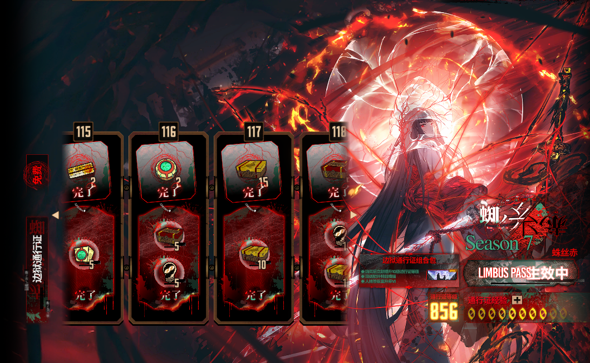
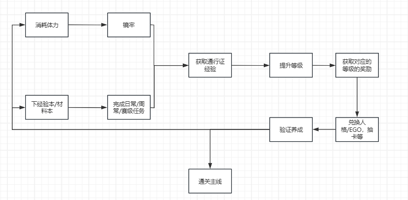
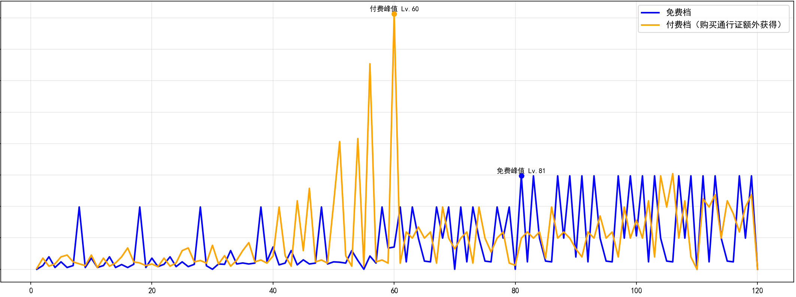

# 《边狱巴士》通行证系统拆解案（作品集优化版）
```markdown

```
> 本文为个人学习与求职作品展示使用。文中涉及《Limbus Company / 边狱巴士》的游戏素材、设定、数据与名称，其版权归 Project Moon 所有。本文仅用于系统设计分析，不作商业用途。

## 0. 结论

**分析对象**：《边狱巴士》赛季通行证系统  
**版本参考**：v.1.109.0  
**拆解方向**：商业化系统 / 资源投放 / 留存循环 / 玩家分层  
**适配岗位**：系统策划、商业化策划、数值策划、执行策划实习

本案核心结论：

1. 《边狱巴士》的通行证不是单纯的“奖励打包售卖”，而是连接体力消耗、镜牢玩法、人格碎片兑换和赛季留存的核心系统。
2. 该通行证的高性价比来自游戏本身的“抽取 + 碎片兑换”双轨角色获取结构。它并非单纯让利，而是在为“时间换角色”的长期循环定价。
3. 120 级后的无限碎片箱机制，让玩家的重复游玩始终有确定收益，显著缓解抽卡失败带来的挫败感。
4. 免费玩家、通行证玩家、重度玩家和氪金玩家之间主要形成“效率差异”，而不是强烈的内容隔离或强度隔离，因此付费压力相对柔和。
5. 该系统的主要风险是：满级后刷镜牢行为过于单一，容易让核心玩家产生重复劳动感；赛季末入坑玩家也会因追赶压力降低购买意愿。
6. 优化方向应优先围绕“减负但不增发”“追赶但不破坏公平”展开，而不是简单提高奖励。

---

## 1. 系统定位

《边狱巴士》的通行证承担四个核心职能：

| 职能 | 对玩家的意义 | 对产品的意义 |
| --- | --- | --- |
| 资源投放 | 提供经验、纺锤、体力、狂气、碎片箱等养成资源 | 控制赛季整体养成进度 |
| 留存驱动 | 每日/每周任务推动玩家持续上线 | 稳定 DAU 与周活跃 |
| 付费转化 | 付费轨提供更高资源效率 | 建立低门槛稳定付费点 |
| 抽卡兜底 | 碎片箱提供确定性角色获取路径 | 缓解抽卡负反馈，延长长期目标 |

从系统设计上看，通行证的本质是一个“中长期资源合约”：玩家投入时间或付费，换取稳定、可预期、可积累的养成进度。

因此，它并不是独立存在的付费功能，而是和以下系统共同组成完整循环：

- 体力系统：提供玩法消耗入口。
- 日常/周常任务：提供通行证经验来源。
- 镜牢玩法：提供高频重复游玩的主要场景。
- 碎片箱机制：提供人格兑换进度。
- 人格/EGO 养成：提供玩家继续投入资源的目标。
- 赛季更新：重置目标，制造新的追求周期。

---

## 2. 核心循环拆解

### 2.1 主循环

《边狱巴士》通行证与游戏主循环的关系可以概括为：

```text
每日/每周任务 -> 获得通行证经验 -> 提升通行证等级 -> 获得资源/碎片箱
       ↑                                                ↓
消耗体力与镜牢游玩 <- 养成人格/EGO <- 碎片兑换/资源培养
```

```markdown

```

### 2.2 关键闭环

最关键的闭环是：

```text
体力消耗 -> 镜牢/日常玩法 -> 通行证经验 -> 碎片箱 -> 人格兑换 -> 配队扩展 -> 继续挑战镜牢
```

这个闭环的优势在于：玩家即使抽卡失败，也能通过持续游玩积累碎片箱，最终兑换目标人格。因此，通行证将“随机抽取的不确定性”部分转化为“持续劳动的确定性回报”。

### 2.3 核心设计逻辑

| 环节 | 玩家行为 | 系统反馈 | 设计目的 |
| --- | --- | --- | --- |
| 清体力 | 打经验本、纺锤本、镜牢 | 获得基础资源与通行证经验 | 消耗体力，形成日常节奏 |
| 升级通行证 | 完成日常/周常 | 解锁免费/付费轨奖励 | 提供持续成长反馈 |
| 获取碎片箱 | 推进通行证等级 | 获得随机/自选碎片 | 提供确定性兑换目标 |
| 兑换人格 | 积累指定碎片 | 获取目标人格 | 缓解抽卡失败体验 |
| 扩展配队 | 培养更多人格/EGO | 挑战更高难内容 | 延长养成深度 |

---

## 3. 奖励结构拆解

### 3.1 120 级以内奖励结构

根据原稿记录，第七赛季通行证奖励可以整理为以下结构：

| 奖励类型 | 免费轨 | 付费轨 | 设计作用 |
| --- | ---: | ---: | --- |
| 经验券 | 三级 30 / 四级 12，约 66000 EXP | 三级 50 / 四级 18，约 104000 EXP | 支撑人格等级养成 |
| 纺锤 | 50 | 250 | 支撑人格同步/养成突破 |
| 体力资源 | 体力饼 9 / 体力盒 30，约 1140 | 体力饼 11 / 体力盒 30，约 1260 | 反哺玩法消耗 |
| 狂气 | 650 | 1300 | 提供抽卡与通用货币价值 |
| 碎片箱 | 随机 380 / 自选 75 | 随机 210 / 自选 125 | 提供人格兑换进度 |
| EGO | 2 | 2 | 提供赛季核心内容与收藏价值 |
| 专用碎片 | 0 | 150 | 提供指定养成/兑换补充 |
| 提取券 | 15 | 15 + 10 | 提供抽卡资源 |
| 成长模组 | 1 | 1 | 提供养成补充 |
| 播报员 | 1 | 1 | 提供收藏与展示价值 |
| 纪念装饰 | 3 | 2 | 提供赛季纪念价值 |

注：原始奖励中部分物品存在估值难度，例如装饰、播报员、部分纪念物。做作品集时应明确区分“可量化资源”和“不可稳定估值资源”，避免让数值结论显得过度武断。


### 3.2 120 级后溢出奖励

120 级后，每提升 1 级：

| 轨道 | 每级奖励 | 设计意义 |
| --- | --- | --- |
| 免费轨 | 1 个自选碎片箱 | 保证免费玩家持续游玩也有进度 |
| 付费轨 | 额外 2 个自选碎片箱 | 将付费转化为更高时间效率 |

购买通行证后，120 级后每级共可获得 3 个自选碎片箱。该机制是《边狱巴士》通行证最关键的长期活跃设计。

它的意义不只是“奖励更多”，而是为玩家提供一个无上限的长期目标：只要继续消耗体力、继续刷镜牢，就能继续获得人格碎片兑换进度。

---

## 4. 价值测算与假设

### 4.1 测算前提

为了避免结论失真，所有价值换算都应先声明假设：

| 项目 | 假设 |
| --- | --- |
| 货币基准 | 以狂气作为统一估值单位 |
| 充值换算 | 不计首充、礼包、限时折扣 |
| 通行证等级 | 1 级可通过 200 狂气购买 |
| 时间样本 | 以一周日常 + 周常 + 镜牢作为基础周期 |
| 不估值内容 | 装饰、播报员、部分纪念物不纳入核心价值测算 |
| 版本口径 | 以 v.1.109.0 与原稿记录为参考 |

原稿中使用的基础换算如下：

```text
1 美元（约 6.78 元人民币）≈ 100 狂气 ≈ 0.76 抽
1 通行证等级 = 200 狂气
体力饼 × 1 ≈ 四级经验券 × 1 + 三级经验券 × 1 + 二级经验券 ≈ 4200 EXP
体力饼 × 1 ≈ 纺锤 × 3
```

### 4.2 周期进度测算

以一周为周期，原稿中估算的通行证经验来源为：

```text
每日任务经验：(2 × 5) × 7 = 70
每周任务经验：4 × 5 = 20
镜牢经验：225
周获取通行证经验：70 + 20 + 225 = 315
约等于：31.5 级 / 周
```

对应体力消耗：

```text
每日资源本消耗：(3 + 2) × 7 = 35
镜牢消耗：18
周体力饼消耗：53
```

由此可以推导：玩家只要维持稳定周常，就能持续获得通行证等级与碎片箱收益。

### 4.3 资源价值测算

```text
免费以及付费奖励的价值以及付费通行证的理论综合价值倍数：
通过对游戏内部资源的考量，将所有资源转化为理论上的综合价值：
游戏以狂气作为基本货币，用于抽卡，升级通行证，购买特殊道具等作用。
狂气分为普通和付费两种：
按照游戏充值系统（不包含特殊礼包、双倍等）：
1美元（6.78人民币）≈100狂气≈0.76抽
通行证可以通过购买的方式升级：1级=200狂气
下面以一周为一个周期进行奖励的分析：
体力饼×1=四级经验券×1+三级经验券×1+二级经验券=4200EXP（大约消耗3~4分钟）
体力饼×1=纺锤×3（大约消耗2~3分钟）
完成一次困牢的经验：225（大约消耗2h，体力饼×18）

通行证的经验以一周一个循环则能获得：
（2×5）×7+（4×5）+225=315=31.5级
消耗的体力饼：
（3+2）×7+18=53
因为通行证1级=200狂气。那么1个饼≈118狂气
根据120级后的每集箱子奖励机制：1级为1个碎片箱≈1.68个体力饼

除去无法估计价值的装饰品和EGO：
免费轨道在120级以内的收益为：
（66000/4200）+（50/3）+（1140/20）+（380+75）*1.68=853.8≈100746.2狂气
总共100746.15+650+1950=103346.2狂气

付费轨道在120级以内的受益为：
（104000/4200）+（250/3）+（1260/20）+（210+125+75）*1.68=859.9≈101,468.2狂气
总共101,468.2+1300+3250=106018.2狂气
```

将不同资源折算为统一价值后，得到以下结论：

```text
免费轨 120 级以内收益：约 103346.2 狂气等值资源
付费轨 120 级以内收益：约 106018.2 狂气等值资源
购买通行证的狂气为付费狂气，1元≈14.7付费狂气
通行证综合性价比：约 5.5 倍
```
> 在不计装饰、播报员等难以稳定估值内容的前提下，通行证综合价值约为 5.5 倍。

### 4.4 与其他二游通行证对比


| 游戏 | 通行证名称 | 价格 | 纯抽卡价值 | 纯抽卡倍数 | 综合折算价值 | 综合倍数 | 每元综合收益 |
| --- | --- | ---: | ---: | ---: | ---: | ---: | ---: |
| 原神 | 珍珠纪行 | 68 元 | 2120 原石 | 3.12 倍 | 约 2500 原石 | 3.68 倍 | 36.8 原石/元 |
| 鸣潮 | 先约电台 | 68 元 | 2280 星声 | 3.35 倍 | 约 2600 星声 | 3.82 倍 | 38.2 星声/元 |
| 崩坏：星穹铁道 | 无名客的荣勋 | 68 元 | 1320 星琼 | 1.94 倍 | 约 2700 星琼 | 3.97 倍 | 39.7 星琼/元 |
| 边狱巴士 | 赛季通行证 | 付费狂气购买 | 需按版本折算 | 高于常规档 | 综合约 5.5 倍 | 高于常规档 | 与碎片箱强相关 |


---

## 5. 商业模型差异：抽取 + 兑换双轨制

常规二游的核心付费点通常是“抽角色”。在这种模型下，通行证一般只能作为养成资源补充，不能过度冲击抽卡资源，否则会削弱卡池收入。

《边狱巴士》的结构不同。它的人格获取并不只依赖抽卡，还存在长期稳定的碎片兑换路径：

```text
抽卡获取人格
      +
碎片箱积累 -> 碎片兑换人格
```

这种双轨制使通行证承担了更重要的功能：

- 它不是单纯发放奖励，而是为“劳动换角色”提供主要资源来源。
- 它不是抽卡系统的替代品，而是抽卡失败后的补偿路径。
- 它不是短期礼包，而是整个赛季的资源主轴。

因此，边狱巴士通行证的高性价比可以理解为：它通过提高时间投入价值，稳定玩家长期活跃，再通过长期活跃带动后续付费与内容消费。

---

## 6. 玩家分层分析

| 玩家类型 | 核心需求 | 通行证提供的价值 | 设计效果 |
| --- | --- | --- | --- |
| 免费玩家 | 低压力体验剧情与基础养成 | 免费轨资源、少量碎片箱 | 保证基础留存，降低流失 |
| 中低付费玩家 | 更高养成效率、更多兑换机会 | 付费轨资源与 120 级后额外箱子 | 形成稳定付费转化 |
| 重度玩家 | 全收集、高难挑战、多配队尝试 | 无限溢出箱子 | 提供长期刷取目标 |
| 氪金玩家 | 节省时间、快速成型 | 购买等级/资源加速 | 用金钱替代重复劳动 |

该分层的优点是：不同玩家获得的是“效率差异”，而不是明显的独占强度差异，因此付费压力相对柔和。

### 6.1 免费玩家

免费玩家通过免费轨也能获得经验券、纺锤、体力、狂气、碎片箱等基础资源。对剧情党、休闲玩家而言，这些资源足以支撑主线体验和基础养成。

免费轨的作用是保证玩家即使不付费，也能感受到持续成长。这部分玩家虽然不直接贡献通行证收入，但能维持社区热度、活跃数据和长期生态。

### 6.2 通行证玩家

购买通行证后，玩家获得的主要不是独占强度，而是更高资源效率。尤其是 120 级后每级额外 2 个自选碎片箱，使付费玩家能够更快完成兑换目标。

这类玩家的心理是：我不是买一个单次礼包，而是买整个赛季的资源效率。

### 6.3 重度玩家

重度玩家的核心目标通常是全收集、多配队、高难挑战。120 级后的无限碎片箱，给这类玩家提供了明确且可重复的长期目标。

但这也是风险来源：当最优行为长期收敛到“反复刷镜牢”时，玩家可能逐渐从“主动游玩”转向“被收益驱动的重复劳动”。

### 6.4 氪金玩家

氪金玩家可以通过购买等级或资源加速，减少重复游玩的时间成本。由于免费玩家和通行证玩家仍然可以通过长期积累获得目标人格，氪金玩家更多是在购买时间效率，而不是完全独占内容。

---

## 7. 设计目的分析

### 7.1 缓解抽卡负反馈

常规抽卡系统的问题在于：玩家投入资源后可能没有获得目标角色，挫败感较强。

《边狱巴士》通过碎片箱机制给玩家提供了另一条路径：

```text
抽不到目标人格 -> 继续完成日常/镜牢 -> 获得碎片箱 -> 积累到指定数量 -> 兑换目标人格
```

这让玩家每次消耗体力都能获得确定性进度。即使短期抽卡失败，长期目标也不会中断。

从体验上看，该设计把“抽卡失败”转化成“兑换进度未完成”。前者容易让玩家产生挫败和流失，后者则更容易引导玩家继续投入时间。

### 7.2 建立长期上线理由

通行证经验绑定每日、周常与镜牢，使玩家形成稳定节奏：

- 每日上线：清体力、完成日常。
- 每周上线：完成镜牢与周常奖励。
- 赛季持续：推进通行证等级，获取碎片箱与赛季资源。

这种结构使通行证成为赛季周期内的资源主轴。

尤其在 120 级之后，通行证并没有结束，而是通过自选碎片箱继续延长目标。这会让玩家产生“每一局都有价值”的感受。

### 7.3 制造柔和付费分层

通行证付费轨的价值主要体现为资源效率提升，而不是直接出售不可替代的强度内容。

这种设计有三个好处：

1. 免费玩家不会因为不买通行证而失去基础体验。
2. 付费玩家能明显感到效率提升，购买理由清晰。
3. 氪金玩家可以用钱节省时间，但不会彻底破坏普通玩家的长期目标。

因此，通行证在商业化上形成了比较柔和的分层：免费玩家用时间换资源，付费玩家用小额付费提升效率，氪金玩家用更高付费节省时间。

### 7.4 控制资源投放节奏

策划可以通过调整通行证奖励内容，控制一个赛季内玩家整体养成速度，例如：

- 增减碎片箱数量，影响人格兑换速度。
- 增减纺锤和经验券，影响角色养成深度。
- 调整狂气和提取券，影响抽卡资源供给。
- 调整 120 级后奖励，影响重度玩家肝度和长期活跃。

通行证因此成为活动之外最稳定的宏观资源调控工具。

---

## 8. 体验曲线分析

原稿将 120 级以内的奖励价值分为免费轨与付费轨，并观察到两者体验曲线不同。


```markdown

```

### 8.1 免费轨：平滑攀升

免费轨的体验特点是稳定、连续、预期清晰。

| 阶段 | 体验特征 | 设计意义 |
| --- | --- | --- |
| 前 40 级 | 奖励相对平缓 | 降低初期压力，让玩家自然进入循环 |
| 40-80 级 | 奖励稳步提高 | 强化持续投入反馈 |
| 80-120 级 | 高价值奖励更密集 | 提高玩家完成通行证的动力 |

免费轨满足的是“持续投入就有持续收益”的基础心理。它不追求强刺激，而是保证玩家每一段时间都有可见进度。

### 8.2 付费轨：中段集中释放

付费轨的体验更像“脉冲式价值释放”。原稿中提到，付费轨在 41-60 级附近出现较强价值峰值，之后高价值资源投放减少，转向装饰、纪念物等内容。

这种设计可能有几个目的：

1. 让购买通行证的玩家在中期快速获得明显收益，强化“买得值”的感受。
2. 让玩家更早获得养成资源，用于培养人格、挑战高难内容。
3. 防止重度玩家过早刷满全部核心资源后失去目标。

从节奏上看，免费轨强调稳定推进，付费轨强调中期爆发，两者共同构成通行证的体验层次。

---

## 9. 问题诊断

### 9.1 问题一：满级后行为单一，容易产生重复劳动感

120 级后的无限碎片箱让体力始终有价值，但最高效行为逐渐收敛为“反复刷镜牢”。

问题表现：

- 玩家目标明确，但行为重复。
- 收益稳定，但过程容易疲劳。
- 重度玩家会把游戏行为转化为固定劳动。
- 当“不刷就亏”的感受超过“我想玩”的感受时，长期留存质量会下降。

设计风险：长期来看，玩家可能不是因为内容有趣而上线，而是因为收益压力上线。这会削弱系统的正向体验。

### 9.2 问题二：赛季末新玩家追赶压力较大

赛季通行证天然存在时间门槛。赛季末入坑或回流玩家会面临两个问题：

- 剩余时间不足，难以拿到核心奖励。
- 购买付费通行证的心理预期降低。
- 如果赛季碎片存在折半或过期处理，新玩家会更容易感到“已经错过”。

设计风险：赛季末新增/回流玩家的付费转化被削弱，且新玩家容易产生挫败感。

### 9.3 问题三：高价值通行证会强化路径依赖

通行证奖励越高，玩家越容易把刷通行证视为最优解。这虽然能提高活跃，但也可能让其他玩法被边缘化。

如果玩家认为“不刷镜牢就亏”，那么玩法选择会从“我想玩什么”变成“什么收益最高”。这会降低长期体验的自由度。

---

## 10. 优化方案一：镜牢增效模块

### 10.1 目标

在不增加总资源投放的前提下，降低重复刷取次数，缓解满级后镜牢疲劳。

设计原则：

```text
减少重复次数，但不提高单位体力收益。
```

### 10.2 解锁条件

| 条件 | 说明 |
| --- | --- |
| 通行证等级 | 达到 120 级后解锁 |
| 适用范围 | 镜牢玩法 |
| 开关方式 | 玩家在进入镜牢前手动选择 |
| 使用对象 | 已进入长期刷取阶段的核心玩家 |

### 10.3 规则设计

| 模式 | 体力消耗 | 通行证经验 | 碎片箱收益 | 单局时长 |
| --- | ---: | ---: | ---: | --- |
| 普通模式 | 100% | 100% | 100% | 标准 |
| 增效模式 | 200% | 200% | 200% | 接近标准 |

核心原则：只提升单位时间效率，不提升单位体力收益。

### 10.4 操作流程

```text
玩家进入镜牢入口
-> 系统判断通行证是否达到 120 级
-> 若满足条件，显示“增效模式”开关
-> 玩家选择普通模式或增效模式
-> 系统检查体力是否足够
-> 完成镜牢后按所选模式结算通行证经验与箱子奖励
```

```markdown

```

### 10.5 边界规则

| 边界情况 | 处理方式 |
| --- | --- |
| 玩家体力不足 | 不可选择增效模式，按钮置灰并提示体力不足 |
| 中途退出 | 按现有镜牢失败/结算规则处理 |
| 每周首次镜牢奖励 | 默认不翻倍，避免奖励异常膨胀 |
| 活动镜牢 | 由活动配置决定是否开放增效 |
| 服务器异常 | 以实际消耗记录为准进行补偿判断 |

### 10.6 预期效果

| 指标 | 预期变化 |
| --- | --- |
| 单周镜牢重复次数 | 下降 |
| 核心玩家疲劳感 | 下降 |
| 单位体力收益 | 不变 |
| 总资源投放 | 基本不变 |
| 玩家满意度 | 上升 |

### 10.7 风险

- 如果开放过早，可能削弱新玩家对镜牢机制的熟悉过程。
- 如果与活动奖励叠加，可能导致资源异常膨胀。
- 如果做成付费专属，会引发“减负也要付费”的负面观感。

建议：作为 120 级后免费解锁的长期减负功能，而不是强付费点。

---

## 11. 优化方案二：赛季末追赶任务

### 11.1 目标

提高赛季末新玩家/回流玩家的参与意愿和付费通行证购买意愿，同时避免对早期玩家造成明显不公平。

设计原则：

```text
帮助追赶核心养成，不完全补齐全部赛季价值。
```

### 11.2 触发条件

| 条件 | 说明 |
| --- | --- |
| 时间 | 赛季结束前 3-4 周 |
| 玩家状态 | 通行证等级低于指定阈值，例如 60 级 |
| 账号类型 | 新玩家或连续流失后回流玩家优先 |
| 入口 | 通行证界面 / 活动界面 / 商城组合包入口 |

### 11.3 任务设计

| 任务类型 | 示例 | 设计目的 |
| --- | --- | --- |
| 主线推进 | 通关指定章节 | 帮助新玩家进入核心内容 |
| 镜牢体验 | 完成若干次镜牢 | 让玩家接触通行证核心经验来源 |
| 养成任务 | 完成角色升级/同步 | 引导资源使用 |
| 日常任务 | 累计登录/完成每日 | 建立短期留存 |

### 11.4 奖励规则

完成追赶任务后，补发一部分核心养成资源，而不是无差别补齐全部奖励。

建议补发：

- 经验券
- 纺锤
- 部分碎片箱
- 部分提取券
- 少量体力资源

不建议补发：

- 大量狂气
- 赛季纪念装饰
- 早期玩家专属纪念奖励
- 付费玩家已经通过时间投入获得的完整溢出收益

这样可以帮助新玩家追赶养成进度，同时保留早期玩家的时间投入价值。

### 11.5 商城配套方案

可在赛季最后 3-4 周上架“通行证追赶组合包”：

| 内容 | 作用 |
| --- | --- |
| 当前赛季付费通行证 | 提供完整付费轨购买入口 |
| 若干通行证等级 | 降低追赶压力 |
| 体力资源 | 引导继续参与镜牢与日常 |
| 核心养成材料 | 帮助新玩家快速形成战斗力 |

该礼包的重点不是强行售卖数值，而是消除新玩家“买了也拿不完”的心理障碍。

### 11.6 预期效果

| 指标 | 预期变化 |
| --- | --- |
| 赛季末通行证购买率 | 上升 |
| 新玩家 7 日留存 | 上升 |
| 回流玩家活跃 | 上升 |
| 老玩家负面反馈 | 可控 |
| 追赶任务完成率 | 可用于判断任务难度是否合理 |

### 11.7 风险

- 如果补发过多，会让早期购买玩家感到不公平。
- 如果任务过重，新玩家仍然会放弃。
- 如果追赶礼包定价过高，会被理解为制造焦虑后售卖解决方案。

建议：追赶任务以“引导参与 + 补核心养成”为主，避免补齐全部赛季价值。

---

## 12. 可验证指标设计

如果该系统进行改版，可以通过以下指标验证效果：

| 目标 | 指标 | 说明 |
| --- | --- | --- |
| 降低疲劳 | 单玩家每周镜牢次数 | 增效模块上线后，重复次数应下降 |
| 保持活跃 | 周活跃率 / 周任务完成率 | 减负后不应明显降低活跃 |
| 控制资源 | 人均碎片箱获取量 | 单位体力收益不应异常提升 |
| 提升付费 | 通行证购买率 | 追赶任务应提升赛季末购买意愿 |
| 改善新手体验 | 新玩家 7 日 / 14 日留存 | 判断追赶机制是否有效降低入坑压力 |
| 控制舆情 | 老玩家负反馈数量 | 判断补发策略是否破坏公平感 |

这些指标能体现策划不是只提出想法，而是能思考方案上线后的验证方式。

---

## 13. 总结

《边狱巴士》的通行证系统优秀之处，不在于单纯“奖励多”，而在于它与游戏的角色获取、体力消耗、镜牢玩法和赛季节奏高度耦合。

它用碎片箱机制解决了抽卡游戏中常见的失败挫败感，又通过 120 级后的无限奖励把重度玩家的时间投入转化为确定性收益。其高性价比服务于整个“抽取 + 兑换”的商业模型，而不是孤立的福利设计。

但该系统也存在两个中长期风险：满级后行为重复导致疲劳，赛季末追赶压力影响新玩家付费。针对这两点，优化应遵循两个原则：

1. 减负但不额外增发，避免破坏资源经济。
2. 追赶但不完全补齐，避免伤害早期玩家公平感。


---


